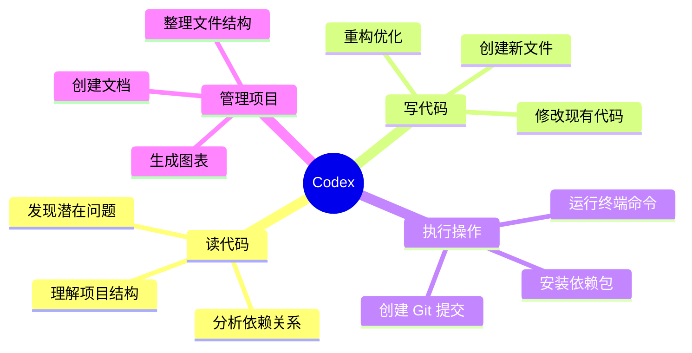
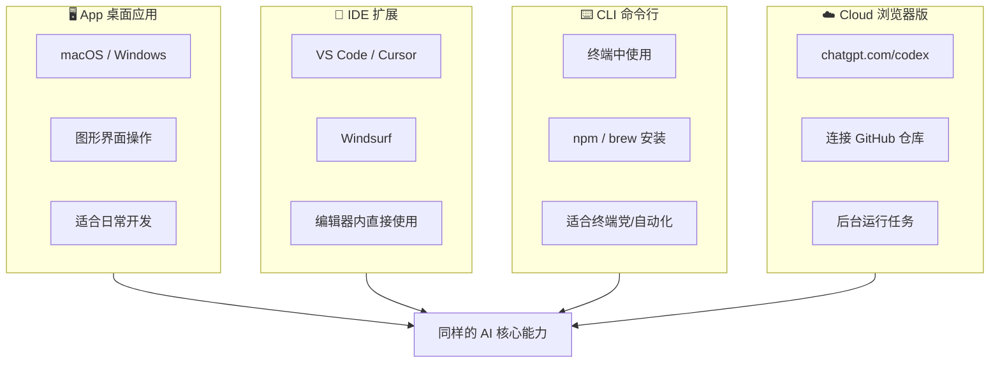
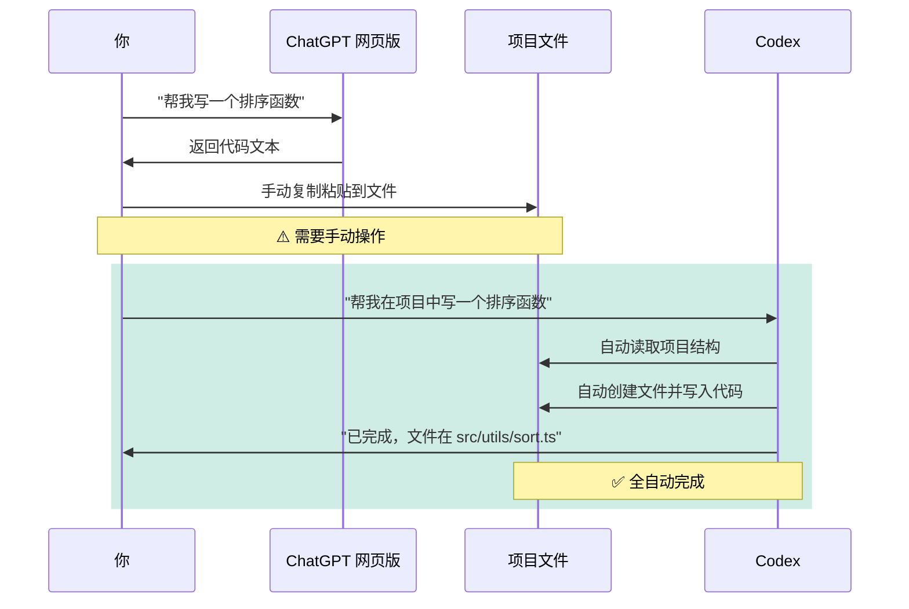
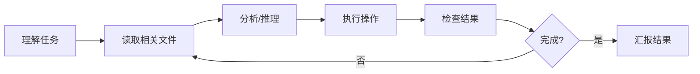
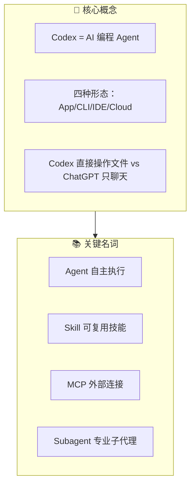

# 第一章：认识 Codex

---

## 1.1 Codex 是什么？

**Codex** 是 OpenAI 推出的 **AI 编程 Agent**——一个能理解你的代码项目、帮你写代码、改 bug、整理文件、甚至做 PPT 的智能助手。

简单来说：**Codex = ChatGPT 的编程能力 + 直接操作你的项目文件的能力**。

> 💡 **一句话理解**：ChatGPT 只能和你"聊天"，Codex 可以直接"动手干活"。

---

## 1.2 Codex 的四种形态

Codex 提供了四种使用方式，适合不同场景：

### 四种形态对比

| 特性     | App 桌面应用 | IDE 扩展 | CLI 命令行 |  Cloud 浏览器版  |
| ------ | :------: | :----: | :-----: | :----------: |
| 图形界面   |    ✅     |   ✅    |    ❌    |      ✅       |
| 需要安装   |    ✅     |   ✅    |    ✅    |      ❌       |
| 操作本地文件 |    ✅     |   ✅    |    ✅    | ❌（操作 GitHub） |
| 后台运行   |    ✅     |   ❌    |    ❌    |      ✅       |
| 离线使用   |    ❌     |   ❌    |    ❌    |      ❌       |
| 适合场景   |   日常全能   |  写代码时  | 服务器/脚本  |    大任务后台跑    |

> 💡 **选哪个？** 大多数人从 **App 桌面应用** 开始最方便。如果你主要用 VS Code 写代码，装 **IDE 扩展** 更顺手。服务器上没有图形界面就用 **CLI**。有超大任务想后台跑就用 **Cloud**。

---

## 1.3 Codex vs ChatGPT 网页版

这是最常见的问题：**我已经在用 ChatGPT 网页版了，为什么还要用 Codex？**

### 核心区别一览

| 维度 | ChatGPT 网页版 | Codex |
|------|:---|:---|
| **工作方式** | 对话式问答 | Agent 自主执行 |
| **文件操作** | 只能上传/下载文件 | 直接读写项目文件 |
| **代码理解** | 看到你粘贴的片段 | 理解整个项目结构 |
| **执行命令** | 不能 | 可以运行终端命令 |
| **上下文** | 当前对话窗口 | 整个项目 + 记忆系统 |
| **自动化** | 手动问答 | 可后台自动完成任务 |
| **Git 集成** | 无 | 自动 checkpoint、创建 PR |
| **适合任务** | 问答、解释、简单代码 | 完整开发任务、重构、部署 |

### 用一张图理解区别

### 什么时候用哪个？

**用 ChatGPT 网页版：**
- 问一个不涉及项目代码的编程问题
- 快速生成一小段代码片段
- 学习新技术概念的对话

**用 Codex：**
- 需要操作项目文件的任何任务
- 多步骤的开发工作（改代码 → 测试 → 修复 → 提交）
- 整理项目文件结构
- 批量修改多个文件

> 💡 **简单记忆**：ChatGPT 是"顾问"，Codex 是"员工"。顾问给你建议，员工直接干活。

---

## 1.4 核心名词解释

在开始使用 Codex 之前，先了解这些重要概念：

### Agent（智能代理）
Codex 的核心工作模式。Agent 能**自主决策**——读取文件、分析问题、执行命令、写代码，形成一个完整的工作循环，不需要你每一步都手动操作。

### Skill（技能）
可复用的工作流模块。你可以理解为 Codex 的"专业培训"——一个 Skill 教会 Codex 如何处理某一类特定任务。

> 📸 **[截图位置]**：Codex App 中输入 `$` 时弹出的 Skill 选择菜单
>
> 详细内容见 [第五章：Skill 技能系统](./05-skills.md)

### MCP（Model Context Protocol / 模型上下文协议）
让 Codex 连接外部工具的标准协议。比如连接 Linear 看任务、连接 Figma 读设计稿、连接数据库查数据。

> 💡 **简单理解**：MCP 是 Codex 的"API 接口"，让它能和外面的工具说话。

### Subagent（子代理）
你可以创建专门的"小助手"来处理特定类型的任务。比如一个专门跑测试的 agent，一个专门查日志的 agent。

> 💡 **类比**：你是项目经理，Codex 是技术主管，Subagent 就是各个专业工程师。

### Sandbox（沙箱）
Codex 执行代码时的安全隔离环境。确保 Codex 运行的程序不会影响你的系统安全。

### Worktree（工作树）
Git 的隔离工作区功能。Codex 可以在独立的工作树中做实验性修改，不影响你的主工作区。安全干净。

### AGENTS.md（项目指南文件）
放在项目根目录的配置文件，告诉 Codex "我们这个项目怎么工作"——比如构建命令、代码规范、测试要求。

### config.toml
Codex 的全局配置文件（`~/.codex/config.toml`），控制 Codex 的行为、权限、外观等。

### Checkpoint（检查点）
类似游戏存档。Codex 在执行可能有风险的操作前自动创建 Git checkpoint，出问题了可以一键回滚。

---

## 本章小结

> ✅ **学完本章你应该知道：**
> - Codex 是一个能直接操作项目文件的 AI 编程工具
> - 它有 App、CLI、IDE、Cloud 四种形态
> - 和 ChatGPT 网页版的本质区别是"直接干活 vs 纯聊天"
> - Agent、Skill、MCP 等核心概念的基本含义

**下一步：** 👉 [第二章：安装与登录](./02-installation.md)
