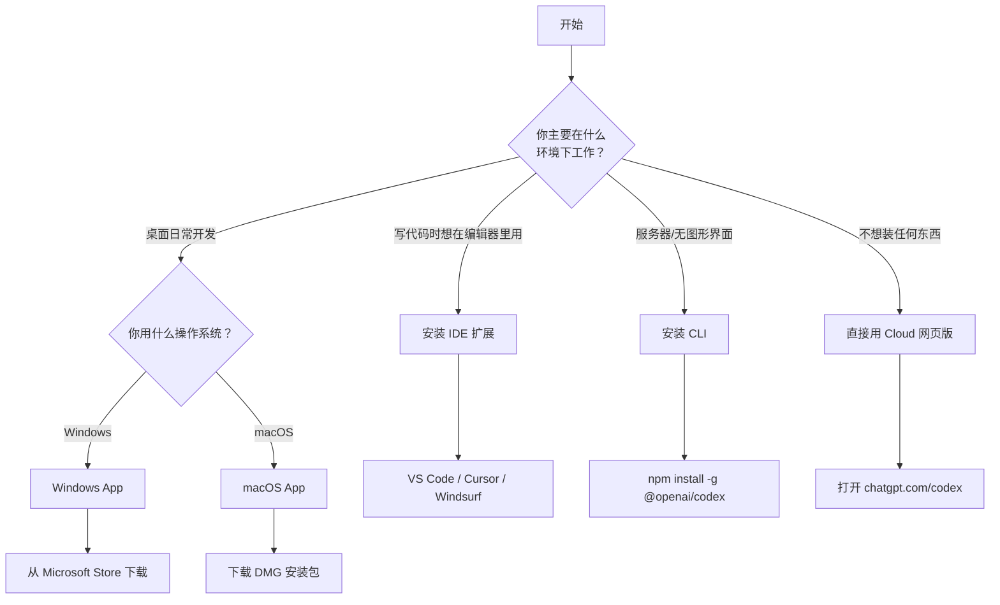

# 第二章：安装与登录

---

## 2.1 选择你的安装方式

在开始之前，先确定哪种方式最适合你：



---

## 2.2 App 桌面应用安装

### Windows 安装

**步骤 1：打开 Microsoft Store**

点击 Windows 开始菜单，搜索 "Microsoft Store" 并打开。

> 📸 **[截图位置]**：Windows 开始菜单中搜索 Microsoft Store 的界面

**步骤 2：搜索 Codex**

在 Microsoft Store 搜索栏输入 "OpenAI Codex"。

> 📸 **[截图位置]**：Microsoft Store 中搜索 Codex 的结果页面

**步骤 3：点击安装**

找到 OpenAI Codex 应用，点击"获取"或"安装"按钮。

```ascii
┌──────────────────────────────────────┐
│        Microsoft Store               │
│  ┌─────────────────────────────┐     │
│  │ 🔍 OpenAI Codex             │     │
│  └─────────────────────────────┘     │
│                                      │
│  ┌──────────────────────────┐        │
│  │  🤖 OpenAI Codex         │        │
│  │  OpenAI                  │        │
│  │  ⭐⭐⭐⭐⭐ (4.5)         │        │
│  │                          │        │
│  │  [  获取  ]  ← 点这里    │        │
│  └──────────────────────────┘        │
└──────────────────────────────────────┘
```

**步骤 4：等待安装完成**

安装完成后，在开始菜单就能找到 Codex 图标了。

> 📸 **[截图位置]**：开始菜单中的 Codex 应用图标

### macOS 安装

**Apple Silicon（M1/M2/M3/M4 芯片）Mac：**

1. 打开浏览器，访问：`https://persistent.oaistatic.com/codex-app-prod/Codex.dmg`
2. 下载 DMG 文件后双击打开
3. 将 Codex 图标拖入 Applications 文件夹

**Intel 芯片 Mac：**

1. 打开浏览器，访问：`https://persistent.oaistatic.com/codex-app-prod/Codex-latest-x64.dmg`
2. 同样的拖拽安装流程

```ascii
┌──────────────────────────────────────┐
│         Codex DMG 安装窗口           │
│                                      │
│    ┌──────┐      ┌──────────────┐   │
│    │ 🤖   │      │              │   │
│    │Codex │  →   │ Applications │   │
│    │      │      │  文件夹       │   │
│    └──────┘      └──────────────┘   │
│                                      │
│   拖拽 Codex 到 Applications        │
└──────────────────────────────────────┘
```

> ⚠️ **注意**：macOS 首次打开时会提示"无法验证开发者"。去 **系统设置 → 隐私与安全性** 中点击"仍然打开"即可。

> 📸 **[截图位置]**：macOS 安全提示窗口 + 系统设置中的"仍然打开"按钮

---

## 2.3 CLI 命令行安装

### 通过 npm 安装（推荐）

**前提：** 你的电脑需要安装 [Node.js](https://nodejs.org/)（版本 18 或以上）。

```bash
# 在终端中执行
npm install -g @openai/codex
```

安装完成后验证：

```bash
codex --version
# 输出类似：@openai/codex v1.x.x
```

```ascii
┌─────────────────────────────────────────────┐
│  $ npm install -g @openai/codex             │
│                                             │
│  added 150 packages in 10s                  │
│                                             │
│  $ codex --version                          │
│  @openai/codex/1.0.0 win32-x64 node-v20.0.0 │
│                                             │
│  $ codex                                    │
│  Welcome to Codex! Let's get started...     │
└─────────────────────────────────────────────┘
```

> 📸 **[截图位置]**：终端中安装 Codex CLI 的完整输出

### 通过 Homebrew 安装（macOS）

```bash
brew install codex
```

> ⚠️ **注意**：如果 Homebrew 还没装，先去 [brew.sh](https://brew.sh) 按指引安装。

---

## 2.4 IDE 扩展安装

### VS Code / Cursor / Windsurf

在编辑器的扩展市场搜索 "OpenAI Codex" 或 "ChatGPT"：

```ascii
┌──────────────────────────────────────────────┐
│  VS Code 扩展面板                            │
│  ┌──────────────────────────────────────┐    │
│  │ 🔍 OpenAI Codex                      │    │
│  └──────────────────────────────────────┘    │
│                                              │
│  ┌─────────────────────────────────────┐     │
│  │ 🤖 ChatGPT - OpenAI Codex           │     │
│  │ OpenAI                   ⬇ 1.2M     │     │
│  │ ★★★★★                             │     │
│  │                                     │     │
│  │ The Codex extension for VS Code...  │     │
│  │                                     │     │
│  │ [ Install ]  ← 点击安装             │     │
│  └─────────────────────────────────────┘     │
└──────────────────────────────────────────────┘
```

| 编辑器 | 安装方式 |
|--------|---------|
| VS Code | 扩展市场搜索 `openai.chatgpt` |
| Cursor | 扩展市场搜索 `openai.chatgpt` |
| Windsurf | 扩展市场搜索 `openai.chatgpt` |
| VS Code Insiders | 从 Marketplace 安装 |

> 📸 **[截图位置]**：VS Code 扩展面板中 Codex 的安装页面

安装完成后，VS Code 侧边栏会出现 Codex 面板图标。

> 📸 **[截图位置]**：VS Code 侧边栏中 Codex 图标的位置（可能在折叠区域）

> 💡 **提示**：如果侧边栏找不到，检查底部的"已折叠"区域，Codex 面板默认可能被隐藏。

---

## 2.5 Cloud 浏览器版

无需安装任何东西，直接打开浏览器访问：

**🔗 https://chatgpt.com/codex**

```ascii
┌──────────────────────────────────────────────┐
│  🌐 浏览器地址栏                            │
│  ┌──────────────────────────────────────────┐│
│  │ https://chatgpt.com/codex                ││
│  └──────────────────────────────────────────┘│
│                                              │
│  ┌──────────────────────────────────────────┐│
│  │         Welcome to Codex                 ││
│  │                                          ││
│  │  你的 AI 编程搭档，直接在浏览器中工作    ││
│  │                                          ││
│  │  [ 连接 GitHub 仓库 ]                    ││
│  │  [ 开始新任务 ]                          ││
│  └──────────────────────────────────────────┘│
└──────────────────────────────────────────────┘
```

> 📸 **[截图位置]**：Codex Cloud 首页界面

---

## 2.6 登录认证

无论哪种安装方式，第一次使用都需要登录。Codex 支持两种登录方式：

### 方式一：ChatGPT 账号登录（推荐）

使用你的 ChatGPT 账号（Plus / Pro / Team / Enterprise 均可）直接登录。

```ascii
┌──────────────────────────────────────────────┐
│           Codex 登录页面                     │
│                                              │
│   ┌───────────────────────────────────┐      │
│   │  Sign in to Codex                 │      │
│   │                                   │      │
│   │  ┌─────────────────────────────┐  │      │
│   │  │ 📧 Email address            │  │      │
│   │  └─────────────────────────────┘  │      │
│   │                                   │      │
│   │  [ Continue with ChatGPT ]        │      │
│   │                                   │      │
│   │  ──── or ────                     │      │
│   │                                   │      │
│   │  [ Sign in with API Key ]         │      │
│   └───────────────────────────────────┘      │
└──────────────────────────────────────────────┘
```

> 📸 **[截图位置]**：Codex 登录界面，显示两种登录选项

### 方式二：API Key 登录

如果你有 OpenAI API Key，也可以用 API Key 登录。

> ⚠️ **注意**：用 API Key 登录时，某些功能（如 Cloud 同步的对话记录）可能不可用。推荐用 ChatGPT 账号登录获得完整体验。

| 登录方式 | 费用 | 功能完整度 |
|---------|------|-----------|
| ChatGPT 账号 | 包含在订阅中 | 完整 |
| API Key | 按使用量计费 | 部分功能受限 |

---

## 2.7 安装后的验证

无论哪种安装方式，安装登录后做一个简单测试：

### App / IDE 用户：
在对话框中输入：`"帮我看看这个项目是什么样的"`

### CLI 用户：
```bash
cd 你的项目目录
codex
# 然后输入：帮我看看这个项目是什么样的
```

### Cloud 用户：
连接一个 GitHub 仓库后，输入同样的提示词。

如果 Codex 开始分析你的项目并回复，说明安装成功了！🎉

```ascii
┌──────────────────────────────────────────────┐
│  You: 帮我看看这个项目是什么样的            │
│                                              │
│  Codex: 让我先看看项目结构...               │
│                                              │
│  ╔══════════════════════════════════════╗     │
│  ║ 项目结构分析                         ║    │
│  ║                                      ║    │
│  ║ src/          - 源代码目录           ║    │
│  ║ tests/        - 测试文件             ║    │
│  ║ package.json  - Node.js 项目配置     ║    │
│  ║ ...                                  ║    │
│  ╚══════════════════════════════════════╝     │
└──────────────────────────────────────────────┘
```

> 📸 **[截图位置]**：Codex 首次成功回复的界面

---

## 本章小结

| 安装方式 | 适合人群 | 一句话步骤 |
|---------|---------|-----------|
| App 桌面应用 | 大多数用户 | Microsoft Store / DMG 下载安装 |
| IDE 扩展 | 在编辑器里写代码的人 | 扩展市场搜索安装 |
| CLI | 终端党、服务器 | `npm install -g @openai/codex` |
| Cloud | 不想装软件的人 | 打开 chatgpt.com/codex |

> ✅ **学完本章你应该做到：**
> - [ ] 成功安装了至少一种 Codex
> - [ ] 完成了登录认证
> - [ ] 成功发送了第一条测试消息

**下一步：** 👉 [第三章：第一次使用](./03-first-use.md)
