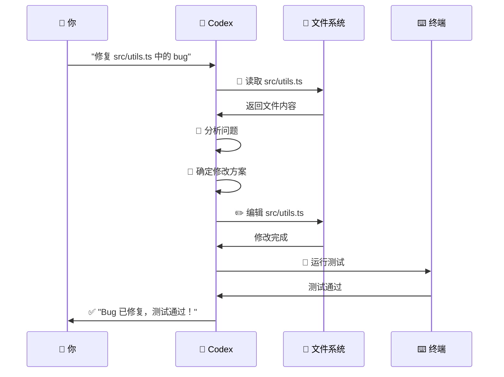
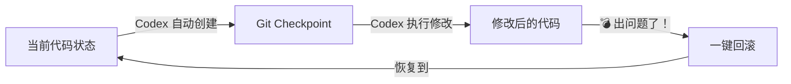
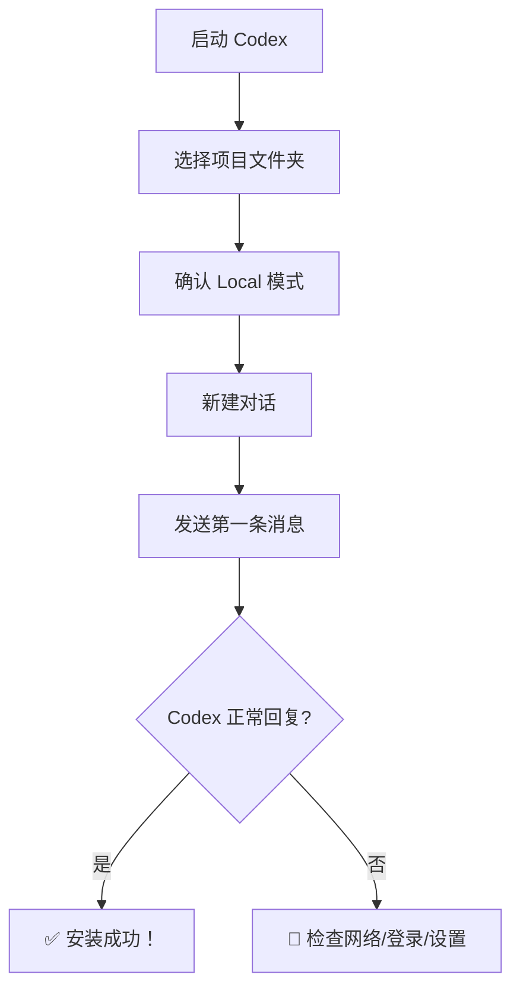

# 第三章：第一次使用

---

## 3.1 启动 Codex App

### 打开应用

安装完成后，从开始菜单（Windows）或应用程序文件夹（macOS）启动 Codex。

> 📸 **[截图位置]**：Codex App 启动后的主界面

你会看到这样的界面：

```ascii
┌──────────────────────────────────────────────────────┐
│  Codex                                   ─ × □      │
├──────────┬───────────────────────────────────────────┤
│          │                                           │
│  对话列表 │          Welcome to Codex                 │
│          │                                           │
│  ┌────┐  │   你的 AI 编程搭档，直接在你的            │
│  │＋  │  │   项目文件中工作。                        │
│  │新对话│                                           │
│  └────┘  │   ┌─────────────────────────────────┐     │
│          │   │ 为新对话输入描述...              │     │
│  ┌────┐  │   └─────────────────────────────────┘     │
│  │历史1│  │                                         │
│  │历史2│  │   最近项目:                              │
│  │ ... │  │   ┌──────────────────────────────┐      │
│  └────┘  │   │ 📁 my-project                 │      │
│          │   │ 📁 another-project             │      │
│          │   └──────────────────────────────┘      │
│          │                                           │
├──────────┴───────────────────────────────────────────┤
│  Local ▼  │  📁 选择文件夹  │  ⚙ 设置               │
└──────────────────────────────────────────────────────┘
```

> 📸 **[截图位置]**：Codex App 主界面全貌，标注各个区域的功能

### 界面区域说明

| 区域 | 位置 | 功能 |
|------|------|------|
| **对话列表** | 左侧栏 | 查看、切换、新建对话 |
| **对话框** | 中间主体 | 和 Codex 对话的主要区域 |
| **模式切换** | 左下角 | 切换 Local / Cloud 模式 |
| **文件夹选择** | 底部 | 选择 Codex 工作的项目目录 |
| **设置** | 底部/右上角 | 配置 Codex 的行为 |

---

## 3.2 选择项目文件夹

这是使用 Codex 的关键第一步——告诉它要在哪个项目里工作。

### 操作步骤：

1. 点击底部的 **"📁 选择文件夹"**
2. 浏览到你的项目目录
3. 点击"选择文件夹"

```ascii
┌──────────────────────────────────────────────────────┐
│              选择项目文件夹                           │
│                                                      │
│  ┌─ 文件浏览器 ───────────────────────────────────┐  │
│  │  📁 Users                                      │  │
│  │    └─ 📁 yourname                             │  │
│  │         └─ 📁 Projects                         │  │
│  │              ├─ 📁 my-app          ← 选这个    │  │
│  │              ├─ 📁 website                     │  │
│  │              └─ 📁 data-analysis               │  │
│  │                                                │  │
│  │  文件夹: my-app                                │  │
│  │                                                │  │
│  │  [ 取消 ]          [ 选择文件夹 ]              │  │
│  └────────────────────────────────────────────────┘  │
└──────────────────────────────────────────────────────┘
```

> 📸 **[截图位置]**：选择项目文件夹的浏览界面

> 💡 **提示**：如果有之前用过 Codex 的项目，会在底部直接显示快捷入口，点击即可切换。

---

## 3.3 理解 Local 模式

Codex App 底部有一个模式切换器，确保选择的是 **Local** 模式。

```ascii
┌──────────────────────────────────────────────────────┐
│  ┌─────────────────────────────┐                     │
│  │ Local ▼                     │  ← 确保选这个      │
│  └─────────────────────────────┘                     │
│                                                      │
│  Local = Codex 直接在你的电脑上操作文件              │
│  Cloud = Codex 在云端操作 GitHub 仓库                │
└──────────────────────────────────────────────────────┘
```

| 模式 | 工作位置 | 何时使用 |
|------|---------|---------|
| **Local** | 你的电脑本地 | 日常开发、修改本地文件 |
| **Cloud** | OpenAI 云端 | 大任务后台跑、操作 GitHub PR |

> ⚠️ **注意**：本教程默认使用 **Local 模式**，这也是最常用的模式。

---

## 3.4 新建一个对话

点击左侧栏的 **"＋ 新对话"** 按钮：

```ascii
┌──────────┬───────────────────────────────────────────┐
│          │                                           │
│  对话列表 │                                           │
│          │   ┌─────────────────────────────────┐     │
│  ┌────┐  │   │ 为新对话输入描述...              │     │
│  │＋  │  │   │ （可选，帮助后续查找）            │     │
│  │新对话│  │   └─────────────────────────────────┘     │
│  └────┘  │                                         │
│          │   或者直接开始输入你的问题：              │
│  ┌────┐  │                                         │
│  │🐍… │  │   ┌─────────────────────────────────┐     │
│  │优化…│  │   │ 帮我看看这个项目...             │     │
│  │Bug… │  │   └─────────────────────────────────┘     │
│  └────┘  │                                         │
│          │                                           │
└──────────┴───────────────────────────────────────────┘
```

> 📸 **[截图位置]**：新建对话的界面，输入描述和第一条消息

> 💡 **提示**：给对话起个描述名（如"重构用户模块"、"修复登录 Bug"），方便以后在对话列表中找到它。

---

## 3.5 发送第一条消息

### 新手推荐的第一条消息：

```
帮我看看这个项目是什么样的，简单介绍一下项目结构。
```

输入后按 Enter（或点击发送按钮），Codex 会开始工作：

```ascii
┌──────────────────────────────────────────────────────┐
│                                                      │
│  You: 帮我看看这个项目是什么样的，简单介绍一下      │
│       项目结构。                                     │
│                                                      │
│  ────────────────────────────────────────────────     │
│                                                      │
│  Codex: 好的，让我先探索一下这个项目...              │
│                                                      │
│  🔍 正在读取文件...                                  │
│     ✓ package.json                                   │
│     ✓ README.md                                      │
│     ✓ src/index.ts                                   │
│     ✓ src/components/                                │
│                                                      │
│  ────────────────────────────────────────────────     │
│                                                      │
│  这是一个 React + TypeScript 的 Web 应用项目。       │
│                                                      │
│  📦 项目结构：                                       │
│  ├── src/              # 源代码                      │
│  │   ├── components/   # React 组件                  │
│  │   ├── utils/        # 工具函数                    │
│  │   └── index.ts      # 入口文件                    │
│  ├── tests/            # 测试文件                    │
│  ├── package.json      # 依赖配置                    │
│  └── tsconfig.json     # TypeScript 配置             │
│                                                      │
│  主要依赖：React 18, TypeScript 5, Vite              │
│                                                      │
│  需要我深入看看哪个部分吗？                          │
│                                                      │
└──────────────────────────────────────────────────────┘
```

> 📸 **[截图位置]**：第一条消息和 Codex 的完整回复

---

## 3.6 认识 Agent 的工作过程

当 Codex 执行任务时，你会实时看到它在做什么：



### 你会看到的操作类型

| 图标/标识 | 含义 | 说明 |
|-----------|------|------|
| 📖 Reading | 读取文件 | Codex 在看你的代码 |
| ✏️ Editing | 编辑文件 | Codex 在修改代码 |
| ⌨️ Running | 执行命令 | Codex 在跑终端命令 |
| 🔍 Searching | 搜索 | Codex 在检索代码 |
| 🧠 Thinking | 思考中 | Codex 在推理分析 |
| ✅ Done | 完成 | 任务完成 |

> 📸 **[截图位置]**：Codex 执行任务时的中间过程展示，包含多种操作类型

---

## 3.7 Git Checkpoint 安全检查点

Codex 在执行可能有风险的操作前，会自动创建 Git checkpoint（检查点）。这就像游戏的"存档"——出问题了可以读档重来。

### 原理：



### 如何回滚：

```bash
# 如果 Codex 的修改不如预期：
git checkout .
# 或者恢复到特定的 checkpoint：
git reflog
git reset --hard <checkpoint-hash>
```

> 💡 **提示**：Codex 会在对话中告诉你"我已经创建了一个 checkpoint"，你也可以在它做重大修改前主动要求："先创建一个 git checkpoint"。

> ⚠️ **注意**：Checkpoint 功能需要你的项目已经是 Git 仓库（有 `.git` 目录）。如果你的项目还没有初始化 Git，先运行：
> ```bash
> git init
> git add -A
> git commit -m "initial commit"
> ```

---

## 3.8 CLI 用户的首次体验

如果你用的是 CLI 版本，流程类似但都在终端中完成：

```bash
# 进入你的项目目录
cd ~/projects/my-app

# 启动 Codex
codex
```

```ascii
┌──────────────────────────────────────────────┐
│  $ cd ~/projects/my-app                      │
│  $ codex                                     │
│                                              │
│  ╔══════════════════════════════════════════╗│
│  ║        Codex CLI v1.0.0                 ║│
│  ║        Working: ~/projects/my-app       ║│
│  ╚══════════════════════════════════════════╝│
│                                              │
│  > 帮我看看这个项目是什么结构                 │
│                                              │
│  [Codex 开始读取文件并分析...]              │
│                                              │
│  这是一个 React 项目，包含以下结构：...      │
│                                              │
│  > █                                          │
└──────────────────────────────────────────────┘
```

> 📸 **[截图位置]**：终端中 Codex CLI 的首次交互界面

### CLI 常用快捷键

| 快捷键 | 功能 |
|--------|------|
| Enter | 发送消息 |
| Ctrl+C | 取消当前操作 |
| Ctrl+D | 退出 Codex |
| ↑/↓ | 浏览历史消息 |

---

## 3.9 Cloud 用户的首次体验

1. 打开 https://chatgpt.com/codex
2. 先设置环境：进入 https://chatgpt.com/codex/settings/environments
3. 连接一个 GitHub 仓库
4. 返回 Codex 界面，开始对话

```ascii
┌──────────────────────────────────────────────────────┐
│  🌐 Codex Cloud                                      │
│                                                      │
│  ┌─────────────────────────────────────────────┐     │
│  │  环境: github.com/yourname/my-project       │     │
│  │  [切换环境]                                 │     │
│  └─────────────────────────────────────────────┘     │
│                                                      │
│  ┌─────────────────────────────────────────────┐     │
│  │  帮我分析一下这个项目的架构                  │     │
│  └─────────────────────────────────────────────┘     │
│                                                      │
│  任务状态: ⏳ 运行中...                              │
│  [查看日志]  [后台运行]                             │
│                                                      │
│  完成后可以在 Diff 视图查看所有修改                  │
└──────────────────────────────────────────────────────┘
```

> 📸 **[截图位置]**：Codex Cloud 的环境配置和任务界面

---

## 本章小结



> ✅ **学完本章你应该能：**
> - [ ] 成功打开了 Codex App（或启动了 CLI/Cloud）
> - [ ] 选择了要操作的项目文件夹
> - [ ] 创建了第一个对话
> - [ ] 发送了第一条消息并得到了有效回复
> - [ ] 理解了 Agent 工作过程和 Checkpoint 机制

**下一步：** 👉 [第四章：基本功能详解](./04-basic-features.md)
