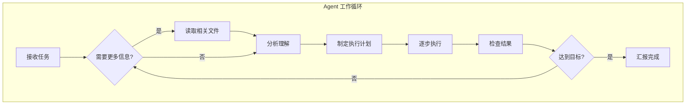
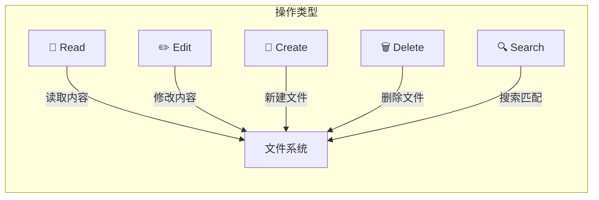

# 第四章：基本功能详解

---

## 4.1 Agent 模式深入理解

### 什么是 Agent 模式？

Agent 模式是 Codex 默认的工作方式。它不是简单地一问一答，而是会**自主执行多步骤任务**。



### Agent 能做什么

| 能力 | 说明 | 示例提示词 |
|------|------|-----------|
| 📖 **读取文件** | 自动发现和读取相关代码 | "看看这个项目的认证逻辑是怎么写的" |
| ✏️ **编写代码** | 创建新文件、修改现有代码 | "创建一个用户登录接口" |
| ⌨️ **运行命令** | 执行终端命令 | "运行测试看看有没有问题" |
| 🔍 **搜索代码** | 全局搜索函数、变量、模式 | "找出所有使用旧 API 的地方" |
| 📦 **管理依赖** | 安装/更新 npm、pip 等包 | "把这个项目升级到 React 19" |
| 🌿 **Git 操作** | 提交、分支、回滚 | "创建一个 PR 修复这个 bug" |

### 一个完整的 Agent 工作示例

当你输入 `"重构 src/api/users.ts，把回调改成 async/await"`：

```ascii
┌──────────────────────────────────────────────────────┐
│                                                      │
│  🔍 正在读取 src/api/users.ts...                    │
│  🔍 正在搜索项目中调用 users API 的地方...           │
│  🔍 正在读取 src/types/user.ts...                   │
│                                                      │
│  🧠 分析完成，发现需要修改 3 个文件：                │
│     1. src/api/users.ts        - 主文件重构         │
│     2. src/components/UserList.tsx  - 调用方适配    │
│     3. tests/users.test.ts     - 测试更新           │
│                                                      │
│  ✏️ 正在修改 src/api/users.ts...                    │
│  ✏️ 正在修改 src/components/UserList.tsx...         │
│  ✏️ 正在修改 tests/users.test.ts...                 │
│                                                      │
│  ⌨️ 运行测试: npm test...                           │
│  ✅ 全部 12 个测试通过                               │
│                                                      │
│  ✅ 重构完成！已将 5 个回调函数改为 async/await，   │
│     所有调用方已适配，测试全部通过。                 │
│                                                      │
└──────────────────────────────────────────────────────┘
```

> 📸 **[截图位置]**：一个完整的多步骤 Agent 任务执行过程

---

## 4.2 对话管理

### 对话列表

左侧栏显示所有对话历史，每个对话是独立的上下文空间：

```ascii
┌────────────────┐
│  对话列表       │
│                │
│  ┌──────────┐  │
│  │ 🔍 搜索... │  │  ← 搜索历史对话
│  └──────────┘  │
│                │
│  ┌──────────┐  │
│  │ 🐍 Snake  │  │  ← 点击切换对话
│  │   游戏开发 │  │
│  ├──────────┤  │
│  │ 🐛 修复   │  │
│  │   登录 Bug│  │
│  ├──────────┤  │
│  │ 📝 写     │  │
│  │   README  │  │
│  ├──────────┤  │
│  │ ...       │  │
│  └──────────┘  │
└────────────────┘
```

> 📸 **[截图位置]**：对话列表界面

### 对话操作

| 操作 | 如何执行 | 说明 |
|------|---------|------|
| **新建** | 点击 "＋ 新对话" | 开启全新上下文 |
| **切换** | 点击历史对话 | Codex 会加载该对话的完整历史 |
| **重命名** | 右键对话 → 重命名 | 改成更有意义的名称 |
| **删除** | 右键对话 → 删除 | 永久删除，不可恢复 |
| **搜索** | 顶部搜索框 | 按关键词查找历史对话 |

> 💡 **提示**：不同任务用不同对话。不要把所有事堆在一个对话里——上下文太长会影响 Codex 的表现。

---

## 4.3 文件操作

### Codex 操作文件的方式

Codex 可以直接在你的项目目录中**创建、读取、修改、删除**文件。



### 常用文件操作提示词

```ascii
┌──────────────────────────────────────────────────────┐
│  📖 读取与分析                                       │
│  "看看 src/utils/helpers.ts 里有哪些函数"            │
│  "分析一下 package.json 的依赖关系"                  │
│  "找出所有使用 axios 的文件"                         │
│                                                      │
│  ✏️ 创建与修改                                      │
│  "在 src/components/ 下创建一个 Button 组件"          │
│  "把所有的 var 改成 const"                           │
│  "在每个 TypeScript 文件开头加上严格模式注释"          │
│                                                      │
│  🗂️ 整理与重构                                      │
│  "把 tests 目录按模块分成子文件夹"                    │
│  "把 utils.ts 里的函数拆分成独立文件"                 │
│  "统一所有文件的缩进为 2 空格"                       │
└──────────────────────────────────────────────────────┘
```

> 📸 **[截图位置]**：Codex 执行文件操作的过程展示

---

## 4.4 代码审查与 Diff 视图

### 审查修改

Codex 在修改代码后，会展示 **Diff 视图**——让你清楚地看到改了什么：

```ascii
┌──────────────────────────────────────────────────────┐
│  📊 修改摘要                                         │
│                                                      │
│  src/utils/helper.ts                                 │
│  ┌────────────────────────────────────────────┐      │
│  │  - function getUser(id: number) {          │      │
│  │  -   return fetch('/api/user/' + id)       │      │
│  │  - }                                        │      │
│  │  + async function getUser(id: number) {    │      │
│  │  +   return fetch(`/api/user/${id}`)        │      │
│  │  + }                                        │      │
│  └────────────────────────────────────────────┘      │
│                                                      │
│  修改了 1 个文件 (+3 行, -3 行)                      │
│                                                      │
│  [ 接受修改 ]  [ 拒绝修改 ]  [ 继续调整 ]            │
└──────────────────────────────────────────────────────┘
```

> 📸 **[截图位置]**：Codex 的 Diff 视图界面

### Cloud 版的 PR Diff

如果你用 Codex Cloud，任务完成后会直接在 GitHub 上预览 PR：

```ascii
┌──────────────────────────────────────────────────────┐
│  ✅ 任务完成                                         │
│                                                      │
│  已创建 Pull Request:                                │
│  🔗 github.com/yourname/my-project/pull/42          │
│                                                      │
│  ┌────────────────────────────────────────────┐      │
│  │  修改了 5 个文件                            │      │
│  │  + 新增 src/api/auth.ts                    │      │
│  │  ~ 修改 src/middleware/auth.ts             │      │
│  │  ~ 修改 tests/auth.test.ts                 │      │
│  │  + 新增 docs/auth-flow.md                   │      │
│  │  ~ 修改 package.json                       │      │
│  └────────────────────────────────────────────┘      │
│                                                      │
│  [ 合并 PR ]  [ 检出到本地 ]  [ 继续修改 ]           │
└──────────────────────────────────────────────────────┘
```

> 📸 **[截图位置]**：Codex Cloud 完成的 PR 预览

---

## 4.5 终端命令执行

### Codex 如何运行命令

在 Agent 模式下，Codex 会自动运行必要的终端命令。你会看到它执行的过程和结果：

```ascii
┌──────────────────────────────────────────────────────┐
│  ⌨️ 终端命令执行                                     │
│                                                      │
│  Codex 正在运行:                                     │
│  $ npm test                                          │
│                                                      │
│  输出:                                               │
│  > my-app@1.0.0 test                                │
│  > vitest run                                       │
│                                                      │
│  ✓ src/utils/helper.test.ts (5 tests)               │
│  ✓ src/api/users.test.ts (3 tests)                  │
│  ✗ src/components/Button.test.ts (1 failed)         │
│                                                      │
│  Tests: 8 passed, 1 failed                          │
│                                                      │
│  🧠 检测到一个失败测试，让我检查问题...              │
└──────────────────────────────────────────────────────┘
```

> 📸 **[截图位置]**：Codex 运行终端命令并分析输出的界面

> ⚠️ **安全提示**：Codex 运行命令前会提示你确认（取决于设置）。对于 `rm -rf`、`git push --force` 等危险命令，请仔细检查后再允许。

---

## 4.6 Slash Commands 斜杠命令

在对话中输入 `/` 可以触发特殊命令（在 CLI 和 IDE 中尤其常用）：

| 命令 | 功能 |
|------|------|
| `/help` | 显示帮助信息 |
| `/clear` | 清除当前对话上下文 |
| `/model` | 切换使用的 AI 模型 |
| `/cost` | 查看当前对话的 token 消耗 |
| `/init` | 为项目初始化 AGENTS.md |
| `/review` | 审查当前分支的修改 |
| `/skills` | 查看可用的 Skills |
| `/memory` | 管理记忆系统 |

> 📸 **[截图位置]**：在对话中输入 `/` 时弹出的命令菜单

---

## 4.7 自动化任务与后台运行

### App 中的后台运行

在 Codex App 中，你可以让任务在后台运行，同时继续其他工作：

```ascii
┌──────────────────────────────────────────────────────┐
│  ┌─────────────────────────────────────────────┐     │
│  │  🔄 后台任务                                 │     │
│  │                                             │     │
│  │  ⏳ 正在运行测试套件...  35%                │     │
│  │  ████████░░░░░░░░░░░░   (42/120 tests)     │     │
│  │                                             │     │
│  │  ✅ 重构用户模块          已完成            │     │
│  │  📋 生成 API 文档         排队中            │     │
│  └─────────────────────────────────────────────┘     │
│                                                      │
│  你可以在任务后台运行时继续新的对话                  │
└──────────────────────────────────────────────────────┘
```

> 📸 **[截图位置]**：后台任务管理面板

### Cloud 中的后台运行

Cloud 版天然支持后台运行——你关闭浏览器后任务仍在云端继续。

---

## 4.8 IDE 扩展的专属功能

如果你用的是 VS Code / Cursor 扩展，还有这些方便的功能：

```ascii
┌──────────────────────────────────────────────────────┐
│  VS Code 中的 Codex                                  │
│                                                      │
│  选中代码 → 右键 →                                  │
│  ┌──────────────────────────┐                       │
│  │ 💡 Codex: 解释这段代码    │                       │
│  │ 🔧 Codex: 修复问题       │                       │
│  │ 📝 Codex: 添加注释       │                       │
│  │ 🧪 Codex: 生成测试       │                       │
│  │ 🔄 Codex: 重构这段代码    │                       │
│  └──────────────────────────┘                       │
│                                                      │
│  在编辑器中直接选中代码，Codex 就能理解和修改        │
└──────────────────────────────────────────────────────┘
```

> 📸 **[截图位置]**：IDE 中右键菜单的 Codex 选项

---

## 本章小结

| 功能 | 核心能力 | 一句话说明 |
|------|---------|-----------|
| Agent 模式 | 自主执行多步骤任务 | Codex 自己会思考该做什么 |
| 对话管理 | 独立上下文空间 | 不同任务放不同对话 |
| 文件操作 | 直接读写项目文件 | 不是复制粘贴，是直接改 |
| 代码审查 | Diff 视图预览 | 清楚看到每个修改 |
| 终端命令 | 自动运行和分析 | 跑测试、装包、执行脚本 |
| Slash 命令 | 快捷指令 | /help、/review、/skills 等 |
| 后台运行 | 多任务并行 | 大任务后台跑，不耽误干别的 |

> ✅ **学完本章你应该能：**
> - [ ] 理解 Agent 模式的工作方式
> - [ ] 管理多个对话
> - [ ] 让 Codex 操作项目文件
> - [ ] 查看 Diff 和审查修改
> - [ ] 使用斜杠命令

**下一步：** 👉 [第五章：Skill 技能系统](./05-skills.md)
