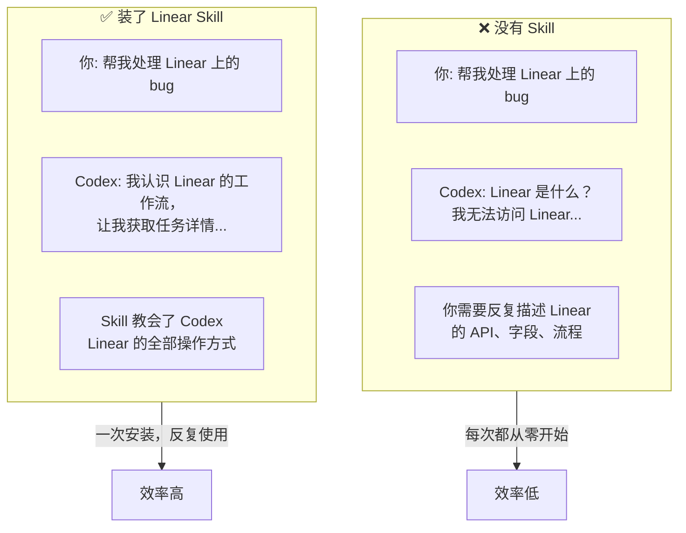
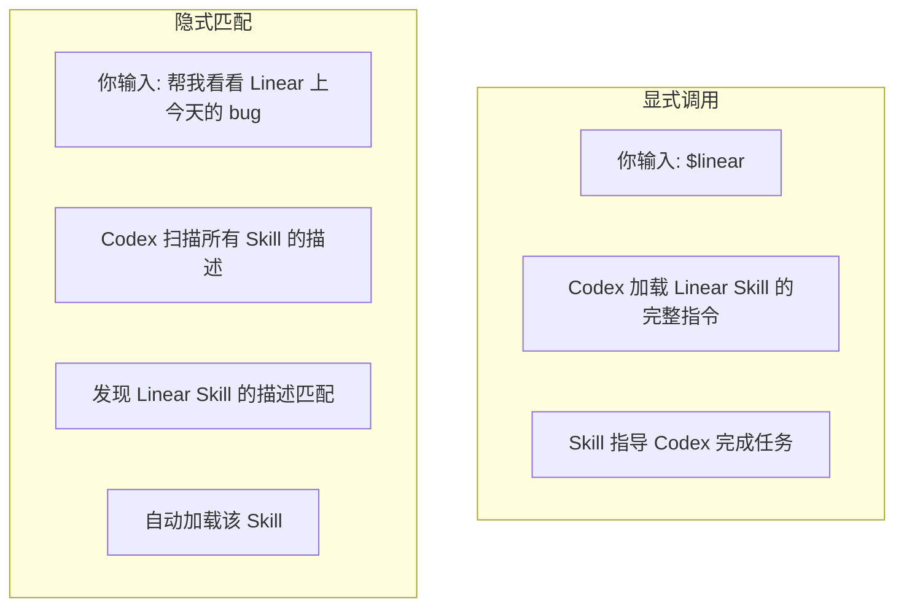
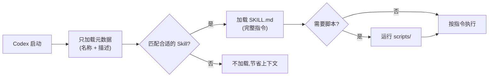
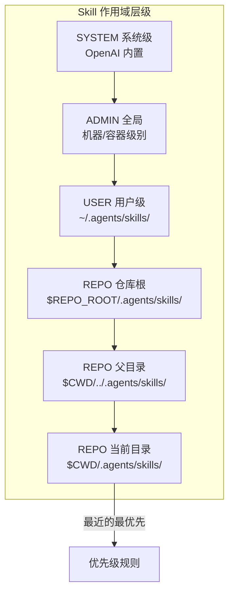
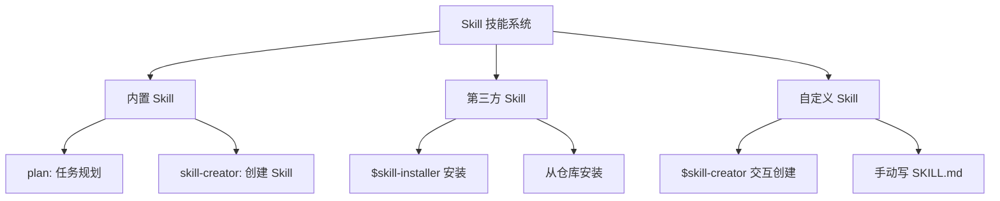

# 第五章：Skill 技能系统

---

## 5.1 什么是 Skill？

### 一句话理解

**Skill（技能）= 给 Codex 安装的"专业培训包"**

就像你给浏览器装扩展一样，Skill 给 Codex 装上处理特定任务的能力。

### 为什么需要 Skill？



---

## 5.2 Skill 的工作机制

### 两种触发方式



| 触发方式 | 如何操作 | 例子 |
|---------|---------|------|
| **显式调用** | 在消息中输入 `$skill名` | `$plan 帮我规划重构方案` |
| **隐式匹配** | 正常描述任务，Codex 自动识别 | "帮我整理会议纪要"→触发会议 Skill |

> 💡 **提示**：Skill 的 `description` 字段决定了隐式匹配是否准确。写得越清楚，Codex 越能在正确的时机自动加载。

### 渐进式加载

Skill 设计了一个聪明的机制来节省 AI 的"注意力"：



---

## 5.3 内置 Skill 介绍

Codex 自带一些系统级 Skill，开箱即用：

| 内置 Skill | 功能 | 如何使用 |
|-----------|------|---------|
| **plan** | 为复杂任务制定分步执行计划 | `$plan` 或 "帮我规划一下..." |
| **skill-creator** | 交互式创建新的自定义 Skill | `$skill-creator` |

### plan Skill 实战

当你面对复杂任务时，先用 `$plan` 让它给你规划：

```ascii
┌──────────────────────────────────────────────────────┐
│  You: $plan 帮我把这个 Vue 2 项目升级到 Vue 3       │
│                                                      │
│  ────────────────────────────────────────────────     │
│                                                      │
│  Codex (plan mode):                                  │
│                                                      │
│  📋 升级 Vue 2 → Vue 3 迁移计划                     │
│                                                      │
│  Step 1: 审计现有项目                                │
│    - 分析当前依赖和 Vue 2 API 使用情况               │
│    - 识别不兼容的第三方库                            │
│                                                      │
│  Step 2: 升级核心依赖                                │
│    - 升级 vue 到 3.x                                 │
│    - 升级 vue-router、vuex/pinia                     │
│    - 升级构建工具 (Webpack → Vite 可选)              │
│                                                      │
│  Step 3: 迁移代码                                    │
│    - Options API → Composition API                    │
│    - 替换已移除的 API (filters, $on 等)              │
│    - 更新 .sync → v-model 绑定                       │
│                                                      │
│  Step 4: 测试验证                                    │
│    - 运行测试套件                                    │
│    - 手动验证关键页面                                │
│    - 修复升级引入的问题                              │
│                                                      │
│  预计修改约 15-20 个文件，是否开始执行？              │
│                                                      │
└──────────────────────────────────────────────────────┘
```

> 📸 **[截图位置]**：使用 `$plan` 后得到的详细规划

---

## 5.4 安装第三方 Skill

使用 `$skill-installer` 安装社区或官方提供的 Skill：

```ascii
┌──────────────────────────────────────────────────────┐
│  You: $skill-installer linear                        │
│                                                      │
│  Codex:                                             │
│  🔍 正在查找 "linear" Skill...                      │
│  ✅ 找到 Linear Skill (官方维护)                     │
│                                                      │
│  描述: 管理 Linear 上的 issue、项目和团队            │
│                                                      │
│  正在安装到 ~/.agents/skills/linear/                 │
│  ✅ 安装完成！                                       │
│                                                      │
│  现在你可以使用 $linear 来管理 Linear 任务了。       │
│  试试: "$linear 显示我的待办任务"                    │
│                                                      │
└──────────────────────────────────────────────────────┘
```

> 📸 **[截图位置]**：安装 Skill 的完整过程

### 从其他仓库安装 Skill

也可以从任意 Git 仓库安装 Skill：
直接在codex对话框输入，codex会自动帮你安装

```
帮我安装这个skill $skill-installer https://github.com/某个用户/某个skill仓库
```

---

## 5.5 创建自定义 Skill

### 方法一：用 $skill-creator（推荐新手）

直接对话创建：

```ascii
┌──────────────────────────────────────────────────────┐
│  You: $skill-creator                                 │
│                                                      │
│  Codex: 好的，让我帮你创建一个新 Skill。             │
│                                                      │
│  Q1: 这个 Skill 用来做什么？                        │
│  You: 自动生成 Python 项目的 API 文档               │
│                                                      │
│  Q2: 应该什么时候触发这个 Skill？                   │
│  You: 当用户说要生成文档、写 API 文档、更新文档时    │
│                                                      │
│  Q3: 需要执行脚本吗，还是纯指令就行？                │
│  You: 纯指令就行                                    │
│                                                      │
│  ✅ Skill "api-doc-generator" 已创建！               │
│     位置: .agents/skills/api-doc-generator/          │
│                                                      │
└──────────────────────────────────────────────────────┘
```

> 📸 **[截图位置]**：用 `$skill-creator` 创建 Skill 的对话过程

### 方法二：手动创建

直接创建文件夹和文件：

```
项目目录/
└── .agents/
    └── skills/
        └── my-skill/
            ├── SKILL.md          ← 必需：指令 + 元数据
            ├── scripts/          ← 可选：可执行脚本
            ├── references/       ← 可选：参考文档
            └── assets/           ← 可选：模板、资源
```

### SKILL.md 文件格式

```markdown
---
name: api-doc-generator
description: |
  当用户需要生成或更新 API 文档时使用此 Skill。
  触发关键词：生成文档、写 API 文档、更新文档、文档生成。
  不适用于：用户界面文档、README 编写。
---

## 你的角色
你是一个 Python API 文档生成专家。

## 工作流程
1. 扫描项目中的所有 API 路由文件
2. 分析每个端点的输入参数和返回值
3. 用 OpenAPI 3.0 格式生成文档
4. 将文档保存到 docs/api/ 目录

## 规范
- 所有文档使用 OpenAPI 3.0 标准
- 包含请求示例和响应示例
- 中文描述 + 英文字段名
```

---

## 5.6 Skill 的作用域

Skill 可以放在不同位置，影响范围不同：



| 作用域 | 存放位置 | 影响范围 |
|--------|---------|---------|
| **当前目录** | `项目/.agents/skills/` | 当前项目子目录 |
| **仓库根** | `仓库根/.agents/skills/` | 整个仓库 |
| **用户级** | `~/.agents/skills/` | 所有项目 |
| **系统级** | `/etc/codex/skills` | 整台机器 |

> 💡 **提示**：团队共享的 Skill 放在仓库根的 `.agents/skills/` 目录，提交到 Git，全团队共用。

---

## 5.7 Skill vs Plugin

这是容易混淆的两个概念：


| 维度 | Skill | Plugin |
|------|-------|--------|
| **是什么** | 一个文件夹（SKILL.md + 资源） | 一个安装包（可包含多个 Skill） |
| **如何使用** | 直接放在 `.agents/skills/` | 通过 `$skill-installer` 安装 |
| **分发方式** | 文件夹复制 / Git 提交 | 发布到插件仓库 |
| **适合场景** | 团队内部使用 | 分发给其他人使用 |
| **包含内容** | Skill 本身 | Skill + MCP 配置 + 图标等 |

> 💡 **简单记忆**：Skill 是"源文件"，Plugin 是"安装包"。你在团队仓库里放的就是 Skill。如果做得好了想分享给全世界，就打包成 Plugin。

---

## 5.8 启用/禁用 Skill

在 `~/.codex/config.toml` 中配置：

```toml
# 禁用某个 Skill（不删除，只是不加载）
[[skills.config]]
path = "/home/user/.agents/skills/old-skill/SKILL.md"
enabled = false
```

修改后重启 Codex 生效。

---

## 5.9 Skill 最佳实践

| 原则 | 说明 |
|------|------|
| **一个 Skill 只做一件事** | 不要一个 Skill 包罗万象 |
| **描述要准确** | 决定隐式匹配是否触发，太宽泛或太窄都不好 |
| **优先用指令而非脚本** | 除非需要确定性或外部工具，纯文字指令更灵活 |
| **测试触发条件** | 用各种提示词测试 Skill 是否在正确时机激活 |
| **写清输入输出** | 每个步骤明确输入什么、输出什么 |

---

## 本章小结



> ✅ **学完本章你应该能：**
> - [ ] 理解 Skill 的概念和工作原理
> - [ ] 使用内置的 `$plan` 和 `$skill-creator`
> - [ ] 安装第三方 Skill
> - [ ] 创建自己的 Skill
> - [ ] 区分 Skill 和 Plugin

**下一步：** 👉 [第六章：核心能力实战](./06-practical-capabilities.md)
