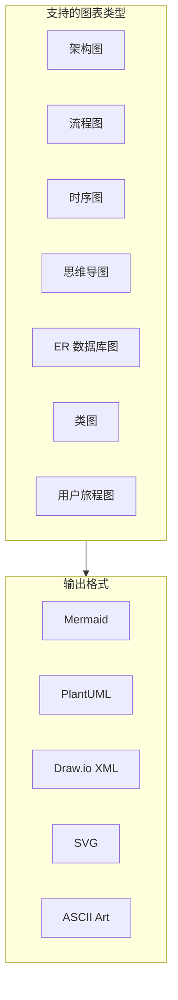
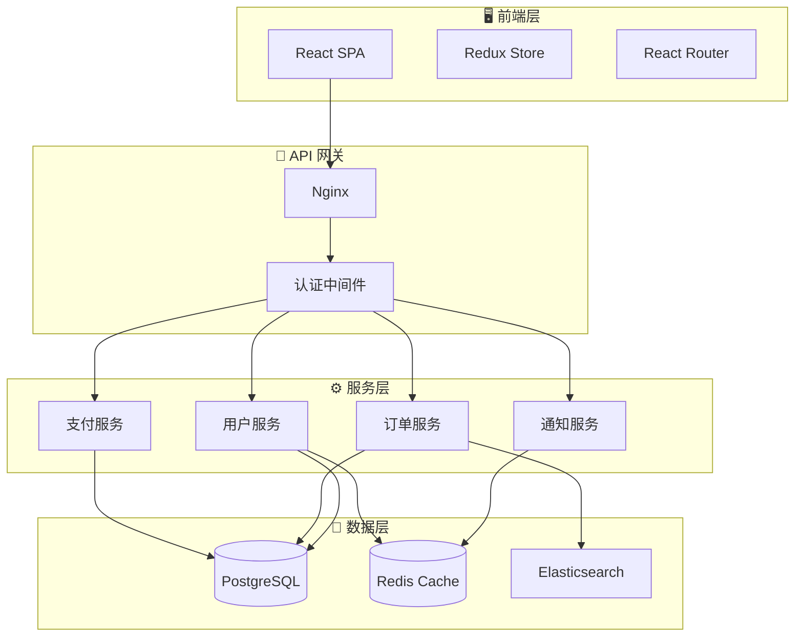
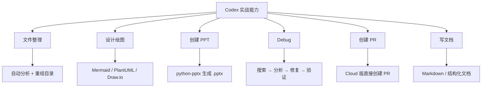

# 第六章：核心能力实战

---

本章通过真实场景，一步步展示 Codex 的各种实战能力。

---

## 6.1 整理与重构项目文件

### 场景：你的项目文件乱七八糟

假设你接手了一个项目，文件结构混乱：

```
项目/
├── utils.js
├── helper_functions.js
├── UserProfile.tsx
├── old_components/
│   ├── button-old.js
│   └── Header_old.tsx
├── tests/
│   ├── test1.js
│   └── userTest.ts
├── README.md
└── package.json
```

### 实际操作

**你只需要说：**

```
帮我把这个项目的文件结构整理一下：
1. 把 JS 文件统一放到 src/ 下
2. 把旧的、不再使用的组件移到 _archive/ 文件夹
3. 重命名所有文件为统一的命名风格（kebab-case 或 PascalCase）
4. 建立清晰的目录结构（components/、utils/、tests/ 等）
```

### Codex 的执行过程

```ascii
┌──────────────────────────────────────────────────────┐
│  🔍 正在扫描项目文件结构...                         │
│                                                      │
│  📋 发现的文件:                                      │
│  ✓ utils.js              → 应移至 src/utils/        │
│  ✓ helper_functions.js   → 应移至 src/utils/        │
│  ✓ UserProfile.tsx       → 应移至 src/components/   │
│  ✓ button-old.js         → 应移至 _archive/         │
│  ✓ Header_old.tsx        → 应移至 _archive/         │
│  ✓ test1.js, userTest.ts → 应移至 tests/            │
│                                                      │
│  📁 建议的新结构:                                    │
│  ├── src/                                           │
│  │   ├── components/UserProfile.tsx                 │
│  │   └── utils/                                     │
│  │       ├── utils.ts                               │
│  │       └── helper-functions.ts                    │
│  ├── tests/                                         │
│  │   ├── utils.test.ts                              │
│  │   └── user.test.ts                               │
│  ├── _archive/                                      │
│  │   ├── button-old.js                              │
│  │   └── Header_old.tsx                             │
│  ├── README.md                                      │
│  └── package.json                                   │
│                                                      │
│  是否执行此方案？                                    │
│  [ 确认执行 ]  [ 调整方案 ]                         │
└──────────────────────────────────────────────────────┘
```

> 📸 **[截图位置]**：Codex 分析文件结构并给出整理方案

### 确认后的执行结果

Codex 会：
1. 创建新目录结构
2. 移动文件到对应位置
3. 更新所有文件内部的 import 路径
4. 运行构建/测试验证一切正常

```ascii
┌──────────────────────────────────────────────────────┐
│  ✅ 文件整理完成！                                   │
│                                                      │
│  操作摘要:                                           │
│  📁 创建了 4 个新目录                                │
│  📦 移动了 8 个文件                                  │
│  🔧 更新了 12 处 import 路径                         │
│  ✅ 所有测试通过 (18/18)                             │
│  ✅ 构建成功                                         │
└──────────────────────────────────────────────────────┘
```

> 📸 **[截图位置]**：整理完成后的项目结构和验证结果

---

## 6.2 设计绘图

### Codex 能画什么？

Codex 可以通过多种方式创建图表：



### 场景实战：画出项目架构图

**你说：**

```
分析这个项目的架构，画一张架构图。
用 Mermaid 格式，包含：前端层、API 层、数据库层、缓存层。
```

**Codex 输出：**



> 📸 **[截图位置]**：Codex 生成的 Mermaid 架构图渲染效果

### 更多绘图场景

| 场景 | 提示词示例 |
|------|-----------|
| 用户登录流程 | "画出用户登录的完整流程图，包括邮箱/手机/OAuth" |
| 数据库关系 | "分析模型文件，画出 ER 数据库关系图" |
| API 调用时序 | "画出订单创建功能的时序图" |
| 项目模块依赖 | "分析 import 关系，画出模块依赖图" |

---

## 6.3 创建 PPT 演示文稿

### Codex 怎么做 PPT？

Codex 可以通过代码方式创建 PowerPoint 文件（使用 python-pptx 库）：


### 场景实战：创建项目汇报 PPT

**你说：**

```
帮我创建一个项目周报 PPT，包含：
- 封面页：项目名称 "电商平台重构"，日期
- 第2页：本周完成的功能（用户模块完成、支付集成80%、Bug修复12个）
- 第3页：关键数据指标（用图表）
- 第4页：下周计划
- 第5页：风险与问题
使用蓝色主题，风格简洁专业。
```

**Codex 的执行：**

```ascii
┌──────────────────────────────────────────────────────┐
│  📊 正在创建 PPT...                                  │
│                                                      │
│  📝 安装依赖: python-pptx                            │
│  ⌨️ pip install python-pptx                          │
│  ✅ 安装完成                                         │
│                                                      │
│  ✏️ 编写生成脚本...                                  │
│  ⌨️ 运行 generate_weekly_report.py                   │
│                                                      │
│  正在创建:                                            │
│  📄 封面页 ── ✅                                     │
│  📄 本周成果 ── ✅                                   │
│  📄 数据指标（含图表）── ✅                          │
│  📄 下周计划 ── ✅                                   │
│  📄 风险与问题 ── ✅                                 │
│                                                      │
│  ✅ PPT 已保存为 weekly_report.pptx                  │
│                                                      │
└──────────────────────────────────────────────────────┘
```

生成的文件可以直接用 PowerPoint / Keynote / WPS 打开：

> 📸 **[截图位置]**：生成的 PPT 文件在 PowerPoint 中打开的效果

### 更多 PPT 场景

| 场景 | 提示词 |
|------|--------|
| 技术方案评审 | "生成一个关于微服务拆分的 PPT，包含背景、方案对比、实施计划" |
| 产品发布介绍 | "做一个产品 v2.0 发布会的 PPT，新功能介绍为主" |
| 培训课件 | "做一个 React Hooks 入门培训的 PPT，带代码示例" |
| 数据分析报告 | "把 data.csv 的数据生成图表 PPT" |

---

## 6.4 Debug 与 Bug 修复

这是 Codex 最强大的能力之一。

### 场景：遇到一个棘手的 Bug

```ascii
┌──────────────────────────────────────────────────────┐
│  You: 用户登录后偶尔会跳回登录页，不是每次都出现。   │
│       帮我找到原因并修复。                           │
│                                                      │
│  ────────────────────────────────────────────────     │
│                                                      │
│  Codex: 这是一个间歇性问题，让我系统排查。          │
│                                                      │
│  🔍 读取 src/auth/AuthProvider.tsx...                │
│  🔍 读取 src/auth/useAuth.ts...                      │
│  🔍 读取 src/middleware/authGuard.ts...              │
│  🔍 搜索所有使用 localStorage token 的地方...        │
│                                                      │
│  🧠 分析发现：                                       │
│                                                      │
│  问题在 AuthProvider.tsx 第 42 行:                   │
│  ┌────────────────────────────────────────────┐      │
│  │ useEffect(() => {                          │      │
│  │   const token = getToken();                │      │
│  │   if (!token) {                            │      │
│  │     router.push('/login'); // ⚠️ 问题在这   │      │
│  │   }                                        │      │
│  │ }, []);                                    │      │
│  └────────────────────────────────────────────┘      │
│                                                      │
│  原因：token 刷新接口是异步的。页面加载时偶           │
│  尔 token 还没返回，但 useEffect 已经执行了，         │
│  导致误判为未登录。                                  │
│                                                      │
│  🔧 修复方案：                                       │
│  1. 给 token 获取加 loading 状态                     │
│  2. 只在 token 获取完成后做判定                     │
│                                                      │
│  ✏️ 正在应用修复...                                  │
│                                                      │
│  ✅ 已修改 AuthProvider.tsx                          │
│  ✅ 已添加 loading 状态保护                          │
│  ⌨️ 运行相关测试: 全部通过                          │
│                                                      │
│  修复完成。这个 Bug 的核心原因是 Token 刷新          │
│  的异步时序问题，现在加了 loading 保护后不会         │
│  再出现误跳转了。                                    │
│                                                      │
└──────────────────────────────────────────────────────┘
```

> 📸 **[截图位置]**：Codex Debug 的完整过程，从分析到修复到验证

### Codex 的 Debug 优势


---

## 6.5 代码现代化改造

### 场景：升级老旧代码

**你说：**

```
帮我把这个 Vue 2 项目升级到 Vue 3：
- Options API → Composition API
- Vuex → Pinia
- 移除已废弃的 API
- 更新所有依赖
```

Codex 会：
1. 分析项目依赖和使用情况
2. 制定分步升级计划
3. 逐个文件迁移
4. 更新依赖版本
5. 运行测试验证

---

## 6.6 创建 Pull Request

### Cloud 版创建 PR

Cloud 版 Codex 完成任务后可以直接创建 PR：

```ascii
┌──────────────────────────────────────────────────────┐
│  ✅ 任务完成: 重构认证模块                           │
│                                                      │
│  修改摘要:                                           │
│  ┌────────────────────────────────────────────┐      │
│  │ 5 files changed                            │      │
│  │ + 120 additions, -85 deletions             │      │
│  └────────────────────────────────────────────┘      │
│                                                      │
│  修改详情:                                           │
│  📝 src/auth/AuthService.ts    重构核心认证逻辑       │
│  📝 src/auth/TokenManager.ts   提取 Token 管理        │
│  📝 src/middleware/auth.ts     更新中间件调用         │
│  📝 tests/auth.test.ts         更新测试              │
│  📝 package.json              更新依赖              │
│                                                      │
│  [ 创建 Pull Request ]                              │
│  [ 继续修改 ]                                       │
│                                                      │
│  ═══════════════════════════════════════              │
│                                                      │
│  PR 已创建:                                          │
│  🔗 github.com/team/project/pull/128                 │
│                                                      │
│  标题: refactor: 重构认证模块，提取 Token 管理器     │
│  描述: (自动生成)                                    │
│  - 将 Token 管理逻辑从 AuthService 中提取            │
│  - 支持 Token 自动刷新                               │
│  - 所有测试通过                                      │
│                                                      │
│  $ git fetch                                         │
│  $ git checkout codex/refactor-auth-module           │
│                                                      │
└──────────────────────────────────────────────────────┘
```

> 📸 **[截图位置]**：Codex Cloud 的 PR 创建界面

---

## 6.7 用 Codex 写文档/教程

Codex 不仅可以写代码，还能写文档——包括你现在正在读的这篇教程！这个教程本身就是在 Codex 的帮助下完成的。

### 本教程的创建过程

```ascii
┌──────────────────────────────────────────────────────┐
│  You: 帮我创建一份 Codex 的完整入门教程              │
│                                                      │
│  Codex:                                              │
│  📖 正在读取官方文档...                             │
│  📖 正在理解教程结构需求...                         │
│                                                      │
│  📋 建议大纲:                                       │
│  1. 认识 Codex (概念篇)                             │
│  2. 安装与登录 (实操篇)                             │
│  3. 第一次使用 (入门篇)                             │
│  ... (完整大纲)                                     │
│                                                      │
│  确认后开始逐章编写...                              │
│                                                      │
│  ✏️ 创建 README.md                                  │
│  ✏️ 创建 chapters/01-what-is-codex.md               │
│  ✏️ 创建 chapters/02-installation.md                │
│  ... (逐章创建)                                     │
│                                                      │
│  ✅ 教程全部章节已完成！                            │
└──────────────────────────────────────────────────────┘
```

---

## 6.8 更多实战场景速查

| 我想... | 可以这样说 |
|---------|-----------|
| 写单元测试 | "给 src/utils/helpers.ts 写完整的单元测试" |
| 代码审查 | "审查一下 src/api/ 目录的代码，找潜在问题" |
| 性能优化 | "分析 src/components/DataTable.tsx 的性能瓶颈" |
| 翻译文档 | "把 README.md 翻译成英文" |
| 生成数据模型 | "根据这个 JSON 生成 TypeScript 类型定义" |
| 配置 CI/CD | "帮我配置 GitHub Actions 的 CI 流程" |
| 数据库迁移 | "帮我写一个数据库迁移脚本，添加 users 表的 email 索引" |
| 写 API 文档 | "给 src/api/ 下所有接口生成 OpenAPI 文档" |
| Docker 化 | "给这个项目写一个 Dockerfile 和 docker-compose.yml" |
| 正则表达式 | "写一个匹配中国大陆手机号的正则表达式" |

---

## 本章小结



> ✅ **学完本章你应该能：**
> - [ ] 让 Codex 整理混乱的项目文件
> - [ ] 生成各种类型的图表
> - [ ] 创建 PPT 演示文稿
> - [ ] 利用 Codex Debug 和修复 Bug
> - [ ] 创建 PR 和管理代码审查
> - [ ] 用 Codex 写文档和教程

**下一步：** 👉 [第七章：定制化配置](./07-customization.md)
