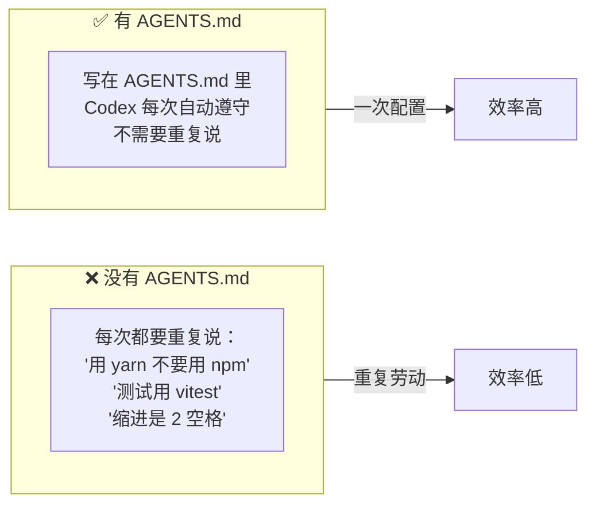
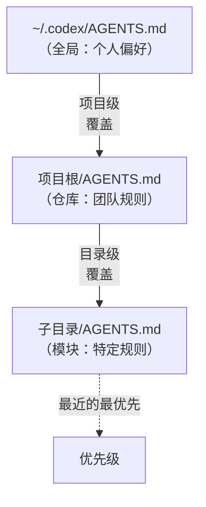
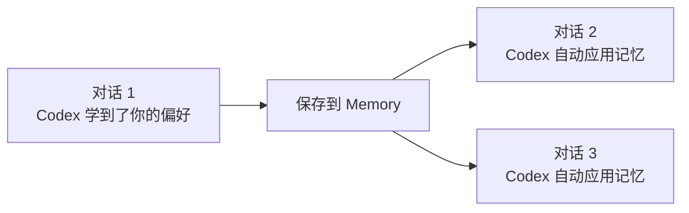
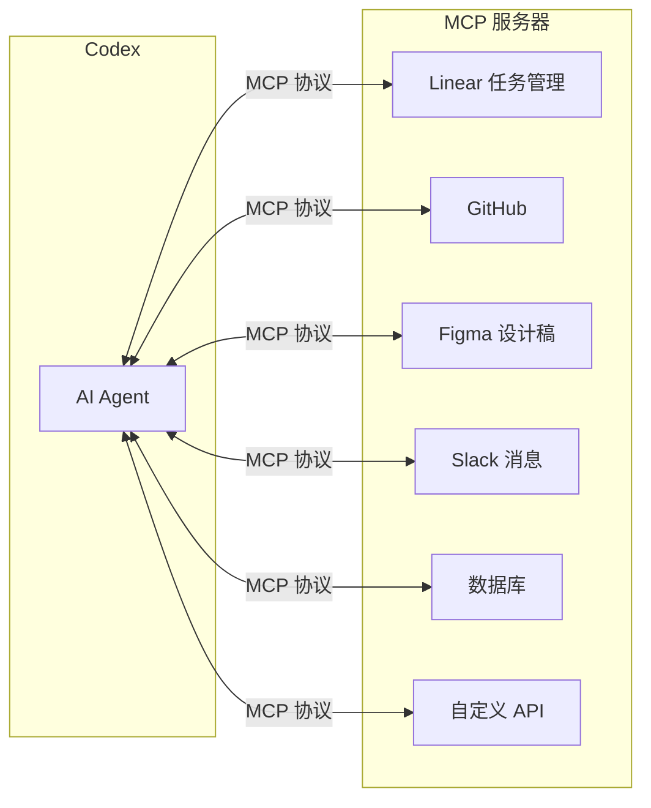
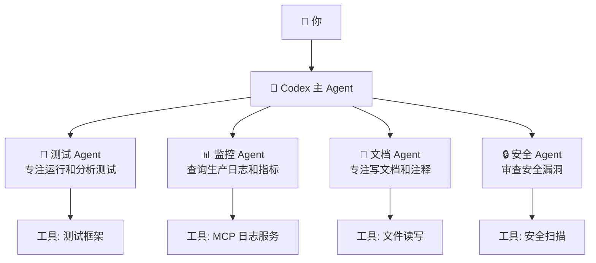
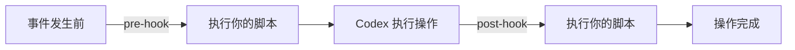
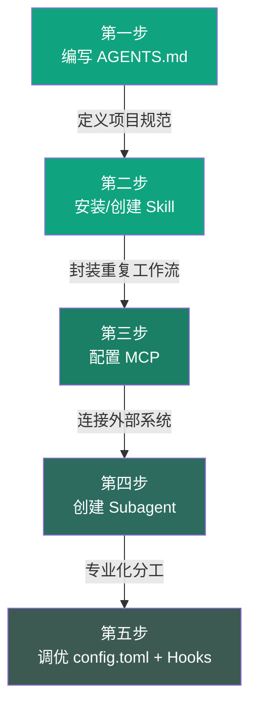

# 第七章：定制化配置

---

## 7.1 AGENTS.md — 项目级持久化指令

### 什么是 AGENTS.md？

**AGENTS.md** 是放在项目里的"说明书"——告诉 Codex 这个项目怎么运作、有什么规则、用什么命令。

每次 Codex 打开这个项目时，会自动读取 AGENTS.md 并遵守其中的规则。

### 为什么需要它？



### 创建 AGENTS.md

在项目根目录创建 `AGENTS.md` 文件，或者在 Codex 对话中输入：

```
/init
```

Codex 会自动分析项目并生成初始的 AGENTS.md。

> 📸 **[截图位置]**：运行 `/init` 命令后 Codex 生成 AGENTS.md 的过程

### AGENTS.md 内容示例

```markdown
# Project: MyApp

## Build/Test Commands
- Install: `yarn install`
- Build: `yarn build`
- Test: `yarn test` (vitest)
- Lint: `yarn lint` (eslint + prettier)
- Type check: `yarn typecheck`

## Code Conventions
- Use TypeScript strict mode
- 2-space indentation
- Functional components with hooks (React)
- No default exports, use named exports
- Path aliases: @/ maps to src/

## Review Expectations
- All PRs must pass CI before merge
- Tests required for new features
- No console.log in production code

## Architecture Notes
- src/api/ — API layer, uses axios
- src/components/ — UI components
- src/hooks/ — custom React hooks
- src/stores/ — Zustand state stores
```

### AGENTS.md 层级



> 💡 **AGENTS.md 写什么？**
>
> - ✅ 构建/测试/检查命令
> - ✅ 代码规范和命名约定
> - ✅ 项目架构说明
> - ✅ 审查标准和合并要求
> - ❌ 不要写太长——Codex 的上下文是有限的

### 何时更新 AGENTS.md

- 当 Codex 反复犯同样的错误
- 当 Codex 读了太多不必要的文件（添加路由指引）
- 当收到重复的 PR 反馈
- 你可以让 Codex 自己更新：`"我纠正你的事情，请更新到 AGENTS.md 中"`

---

## 7.2 Memories 记忆系统

### Memories 是什么？

Memories 是 Codex 的"记忆"——它会在工作过程中记住有用的信息，并在后续对话中使用。



### Memory 的类型

| 类型 | 记录内容 | 示例 |
|------|---------|------|
| **user** | 你的角色、偏好、知识背景 | "用户是资深后端，不太熟悉前端" |
| **feedback** | 你给的纠正和反馈 | "不要 mock 数据库，用真实测试库" |
| **project** | 项目相关的决策和背景 | "Auth 模块重构的原因是合规要求" |
| **reference** | 外部资源链接 | "Bug 追踪用 Linear 项目 INGEST" |

### 管理记忆

在对话中使用 `/memory` 命令：

```ascii
┌──────────────────────────────────────────────────────┐
│  /memory                                            │
│                                                      │
│  📝 当前项目记忆:                                    │
│  ┌────────────────────────────────────────────┐      │
│  │ 📌 Auth 模块重构由合规要求驱动             │      │
│  │ 📌 集成测试必须用真实数据库                 │      │
│  │ 📌 用户偏好中文注释 + 英文命名              │      │
│  │ ...                                         │      │
│  └────────────────────────────────────────────┘      │
│                                                      │
│  [ 查看全部 ]  [ 添加记忆 ]  [ 删除记忆 ]            │
└──────────────────────────────────────────────────────┘
```

---

## 7.3 MCP — 模型上下文协议

### MCP 是什么？

**MCP (Model Context Protocol)** 是连接 Codex 和外部工具的标准协议。如果你用过 ChatGPT Plugins，可以把 MCP 理解为类似的机制。



### MCP 的三大能力

| 能力 | 说明 | 示例 |
|------|------|------|
| **Tools（工具）** | 让 Codex 执行外部操作 | 在 Linear 创建任务、在 Slack 发消息 |
| **Resources（资源）** | 让 Codex 读取外部数据 | 读取 Figma 设计稿、查询数据库 |
| **Prompts（提示模板）** | 预定义的提示词模板 | 标准化的代码审查提示词 |

### MCP + Skill 组合使用

MCP 通常和 Skill 配合使用——Skill 定义工作流，MCP 提供外部连接：

```
Skill: "当用户说要检查 Linear 任务时，用 MCP 获取任务列表，分析优先级，给出建议"

MCP: 提供访问 Linear API 的通道
```

---

## 7.4 Subagent 子代理系统

### 什么是 Subagent？

**Subagent（子代理）** 是你可以创建的专门 AI 助手——每个 Subagent 有特定的角色、工具和职责。



### 为什么用 Subagent？

| 好处 | 说明 |
|------|------|
| **分工明确** | 每个 Subagent 专注于自己的领域 |
| **上下文隔离** | 不同任务不互相干扰 |
| **工具分离** | 不同 Subagent 拥有不同的工具权限 |
| **并行工作** | 多个 Subagent 可以同时工作 |

### Subagent 配置示例

```json
{
  "agents": {
    "test-runner": {
      "role": "运行和分析测试结果",
      "tools": ["bash", "read"],
      "prompt": "你是测试专家。当被调用时运行 npm test，分析失败原因，提出修复建议。"
    },
    "log-analyzer": {
      "role": "查询和分析生产日志",
      "tools": ["mcp:log-service"],
      "prompt": "你是日志分析专家。查询生产日志找出错误和异常模式。"
    }
  }
}
```

---

## 7.5 config.toml 配置文件

Codex 的全局配置文件位于 `~/.codex/config.toml`：

```toml
# Codex 配置示例

[general]
# 默认模型
model = "gpt-5"

[appearance]
# 主题: dark / light
theme = "dark"

[permissions]
# 自动批准文件读取
auto_approve_read = true
# 命令执行需要确认
auto_approve_commands = false

[[skills.config]]
path = "/home/user/.agents/skills/old-skill/SKILL.md"
enabled = false

[hooks]
# 任务完成后的钩子
post_task = "notify-send 'Codex task completed'"
```

---

## 7.6 Hooks 钩子系统

Hooks（钩子）让你在 Codex 执行特定行为的**前后**自动触发脚本：



| 钩子类型 | 触发时机 | 用途示例 |
|---------|---------|---------|
| `pre_task` | 任务执行前 | 自动备份、创建 git branch |
| `post_task` | 任务执行后 | 发送通知、运行测试 |
| `pre_edit` | 修改文件前 | 检查文件是否锁定 |
| `post_edit` | 修改文件后 | 格式化代码、运行 linter |

---

## 7.7 推荐的定制化路径

按照这个顺序逐步定制你的 Codex：



---

## 本章小结

| 配置层 | 作用 | 一句话 |
|--------|------|--------|
| **AGENTS.md** | 项目规则说明书 | 告诉 Codex 这个项目怎么玩 |
| **Memories** | 自动学习记忆 | 吃过一次亏，下次记住 |
| **MCP** | 外部工具连接 | 让 Codex 能和外面的工具交流 |
| **Subagent** | 专业化分工 | 不同类型的活给不同的人干 |
| **config.toml** | 全局配置 | 控制 Codex 的整体行为 |
| **Hooks** | 自动触发脚本 | 在特定时刻自动干点什么 |

> ✅ **学完本章你应该能：**
> - [ ] 创建和维护 AGENTS.md
> - [ ] 理解 Memory 系统
> - [ ] 了解 MCP 和 Subagent 的概念
> - [ ] 会修改 config.toml 基本配置

**下一步：** 👉 [第八章：最佳实践与技巧](./08-best-practices.md)
