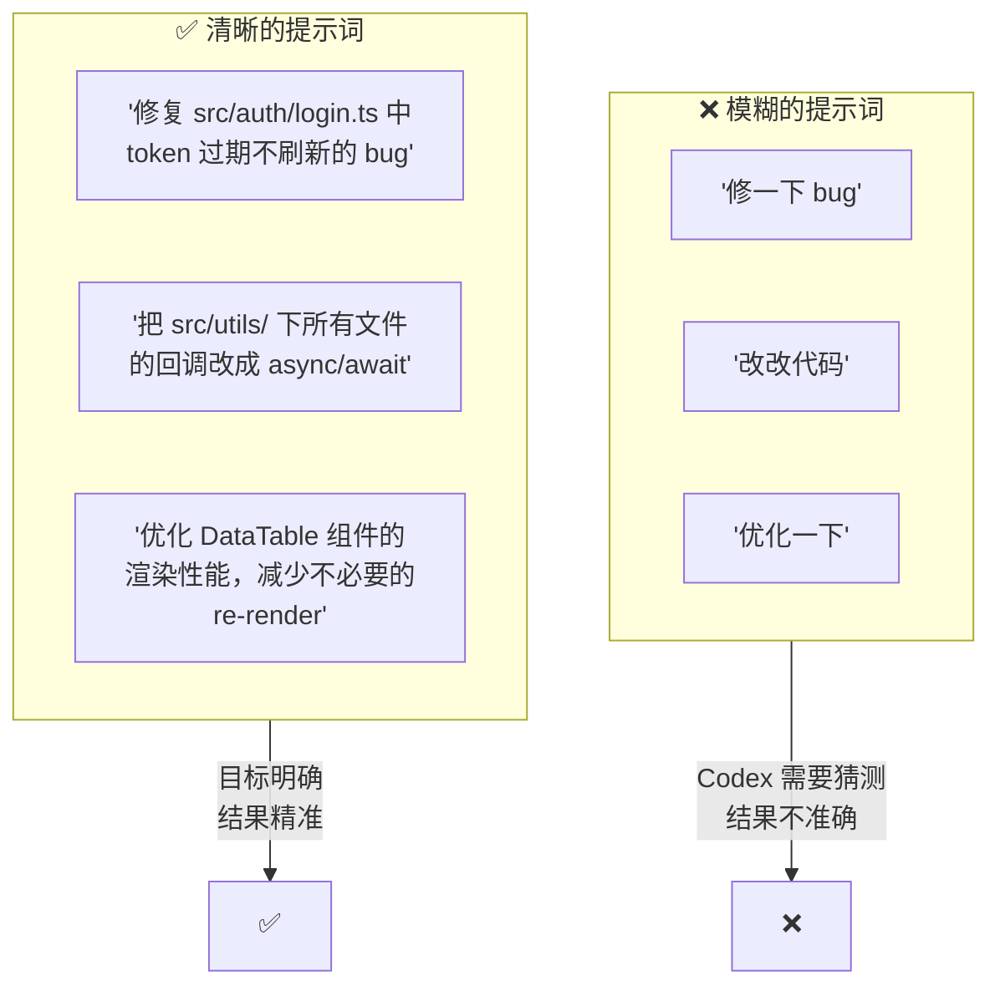
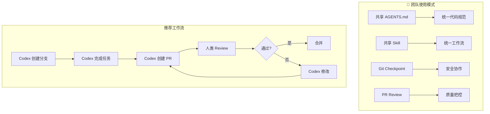
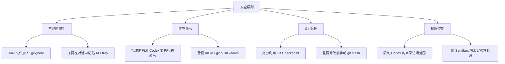
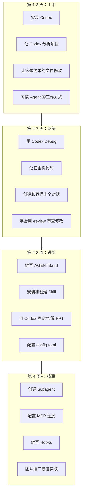
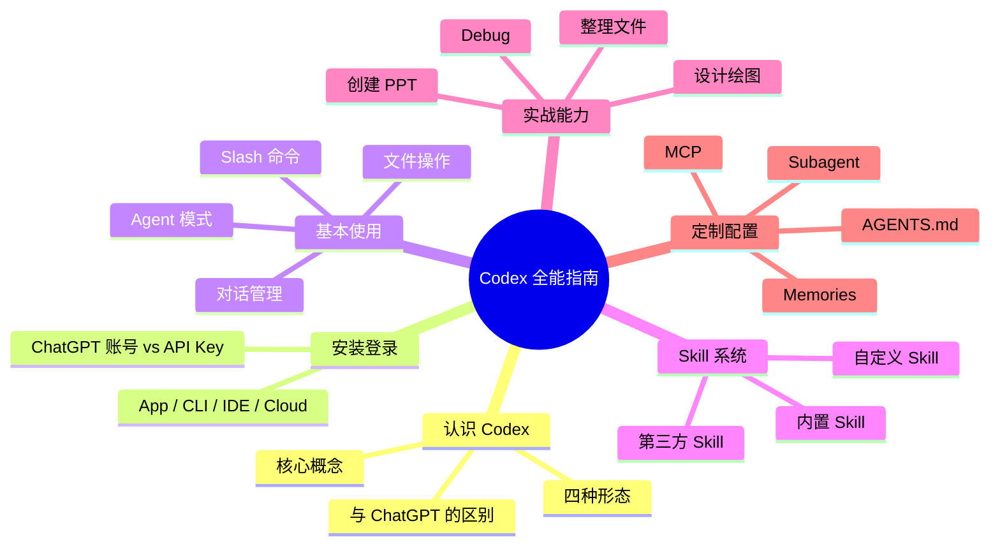

# 第八章：最佳实践与技巧

---

## 8.1 提示词技巧（Prompting Guide）

### 好提示词 vs 坏提示词

Codex 的能力很大程度上取决于你如何提问。写对提示词，事半功倍。



### 提示词公式

一个好的提示词通常包含 4 个要素：

```
[动作] + [目标] + [范围] + [约束]

动作：做什么（修复、创建、分析、优化、重构）
目标：具体对象（哪个 bug、哪个文件、哪个功能）
范围：影响面（只改这一个文件、涉及哪些模块）
约束：限制条件（不要改测试、保持 API 兼容、用 TypeScript）
```

### 实战对比

| 场景 | ❌ 不好的提示词 | ✅ 好的提示词 |
|------|---------------|-------------|
| 修 Bug | "登录有问题" | "修复登录后 token 不自动刷新导致 401 的 bug，只改 src/auth/ 下的文件" |
| 写功能 | "加个搜索" | "在 src/components/SearchBar.tsx 中添加关键词搜索功能，支持防抖 300ms，后端接口是 GET /api/search?q=xxx" |
| 重构 | "重构一下" | "把 src/api/ 下 3 个文件的回调风格改成 async/await，不要改函数签名，确保现有测试通过" |
| 查问题 | "有什么问题" | "分析 src/components/ 下哪些组件有性能问题，重点关注不必要的 re-render" |
| 写文档 | "写个 README" | "为这个 React 项目写 README：技术栈、安装步骤、项目结构、关键设计决策" |

### 更多提示词技巧

| 技巧 | 说明 | 示例 |
|------|------|------|
| **分步指令** | 把大任务拆成小步骤 | "先分析问题，再给方案，等我确认后再执行" |
| **给反例** | 告诉它不要做什么 | "修改 API 但不要改返回格式，前端依赖它" |
| **要求确认** | 关键操作前先确认 | "分析完后先给我看修改方案，确认后再改" |
| **限定范围** | 缩小操作区域 | "只检查 src/api/ 目录，不要动其他文件" |
| **输出格式** | 指定回复形式 | "用表格列出所有需要修改的地方" |
| **给上下文** | 提供背景信息 | "这个项目用 vitest 测试，缩进是 4 空格" |

---

## 8.2 团队协作最佳实践

### 在团队中使用 Codex



### 团队协作清单

| 实践 | 说明 | 优先级 |
|------|------|--------|
| **共享 AGENTS.md** | 团队统一规范，提交到 Git 仓库 | 🔴 必须 |
| **共享 Skill** | 重复工作流放在 `.agents/skills/` | 🟡 推荐 |
| **Git Checkpoint** | 每次大操作前创建检查点 | 🔴 必须 |
| **PR Review** | Codex 的修改必须经过人类审查 | 🔴 必须 |
| **小步提交** | 一次任务一个提交，不要积攒太多 | 🟡 推荐 |
| **命名对话** | 给对话起有意义的名字，方便追溯 | 🟢 建议 |

---

## 8.3 安全注意事项

### 安全原则



### 安全检查清单

| 检查项 | 说明 |
|--------|------|
| ✅ `.gitignore` 已配置 | 确保 `.env`、密钥文件不被提交 |
| ✅ 每次操作前有 Checkpoint | 出问题可以随时回滚 |
| ✅ 危险命令手动确认 | `rm -rf`、`force push` 等必须看清楚 |
| ✅ 不粘贴敏感信息 | 不要在对话中直接贴 API Key、密码 |
| ✅ PR 经过 Review | Codex 创建的 PR 必须人工审查后再合并 |
| ✅ 限制工作目录 | 不要让 Codex 在系统目录中操作 |

> ⚠️ **特别注意**：Codex 可以执行命令，虽然它不会故意做危险操作，但误操作可能发生。做好备份，用好 Git！

---

## 8.4 常见问题排查

### Q1: Codex 找不到我的项目文件

```
可能原因：没有选择正确的项目文件夹
解决：点击底部 "📁 选择文件夹"，导航到项目根目录
```

### Q2: Codex 执行命令时报错

```
可能原因：缺少依赖、环境变量未设置
解决：
1. 让 Codex 检查错误："为什么这个命令报错？"
2. 确保在终端中手动运行该命令能成功
3. 检查 .env 文件是否存在
```

### Q3: Codex 反复犯同样的错误

```
可能原因：AGENTS.md 中没有记录正确的做法
解决：把正确做法写入 AGENTS.md
"请把'使用 yarn 而不是 npm'这条规则更新到 AGENTS.md"
```

### Q4: Codex 的回复越来越慢/不准确

```
可能原因：对话上下文太长
解决：
1. 开启新对话（点击 "＋ 新对话"）
2. 避免在一个对话中堆积太多不相关的任务
```

### Q5: Skill 没有自动触发

```
可能原因：Skill 的 description 不够准确
解决：
1. 检查 SKILL.md 的 description 是否覆盖了你的使用场景
2. 使用显式调用：$skill-name
3. 重启 Codex 让 Skill 变更生效
```

### Q6: 安装的包/skill 不生效

```
可能原因：Codex 没有重启
解决：重启 Codex App / 重新运行 codex 命令
```

### Q7: API Key 登录后某些功能缺失

```
原因：API Key 登录不支持 Cloud 线程等部分功能
解决：切换到 ChatGPT 账号登录获得完整体验
```

---

## 8.5 学习路径建议

从零到熟练的推荐路径：



---

## 8.6 速查表

### 常用 Slash 命令

| 命令 | 功能 |
|------|------|
| `/help` | 显示帮助 |
| `/clear` | 清除对话上下文 |
| `/init` | 初始化 AGENTS.md |
| `/review` | 审查代码变更 |
| `/skills` | 查看可用 Skill |
| `/memory` | 管理记忆 |
| `/model` | 切换模型 |
| `/cost` | 查看 token 消耗 |

### 常用提示词模板

```
# 分析项目
"帮我分析这个项目的架构和技术栈"

# 修复 Bug
"修复 [具体文件] 中的 [具体问题]，不要改动 [约束条件]"

# 重构代码
"重构 [具体文件/目录]，改为 [新方案]，确保测试通过"

# 创建功能
"在 [具体位置] 创建 [功能描述]，遵循 [规范/模式]"

# 写测试
"给 [具体文件] 写单元测试，覆盖 [关键场景]，用 [测试框架]"

# 做文档
"为 [具体模块] 生成 API 文档，格式用 [标准]"

# 审查代码
"审查 [具体目录] 的代码，重点关注 [方面]"
```

---

## 🎉 教程结束

恭喜你完成了 Codex 全方位教程的所有章节！

### 你学到了什么



### 相关资源

| 资源 | 链接 |
|------|------|
| Codex 官方文档 | https://developers.openai.com/codex/quickstart |
| Codex Cloud | https://chatgpt.com/codex |
| Skill 规范 | https://agentskills.io/specification |
| Skill 示例仓库 | https://github.com/openai/skills |
| Codex 更新日志 | https://developers.openai.com/codex/changelog |

---

> 💡 **最后的建议**：Codex 是一个强大的工具，但它不是万能的。把它当作一个**能力很强的搭档**——它帮你干活，你做决策。最好的使用方式是：**你把握方向，Codex 执行细节**。

**Happy Coding! 🚀**
